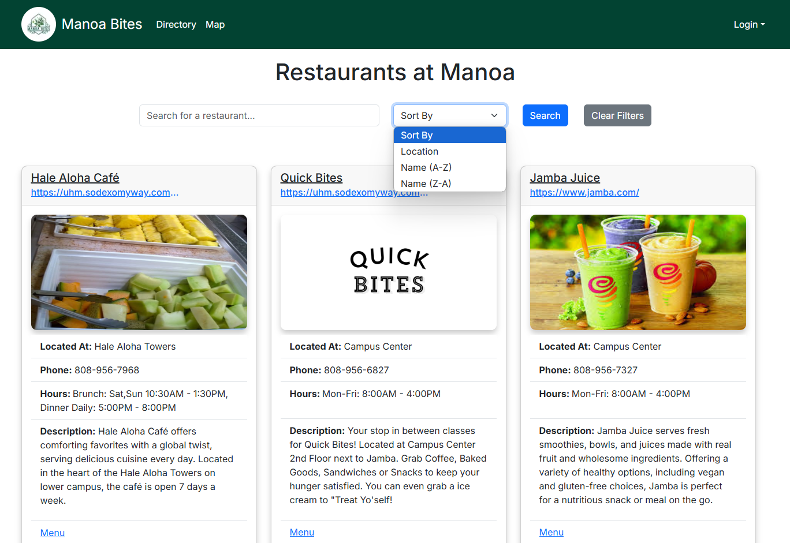
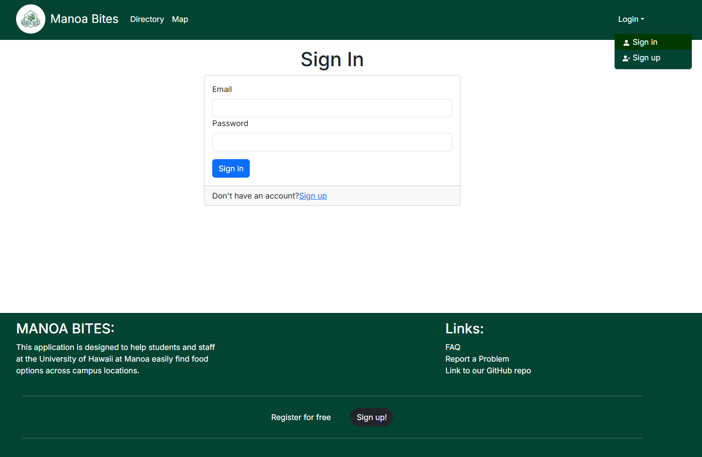
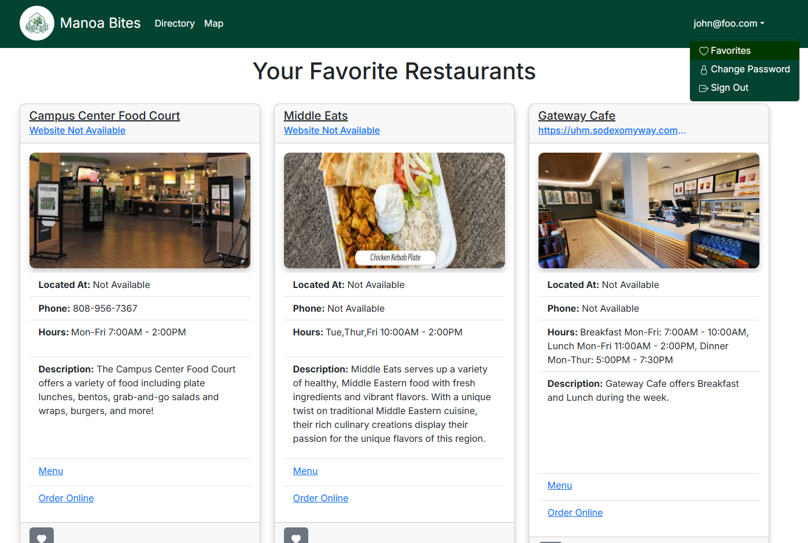
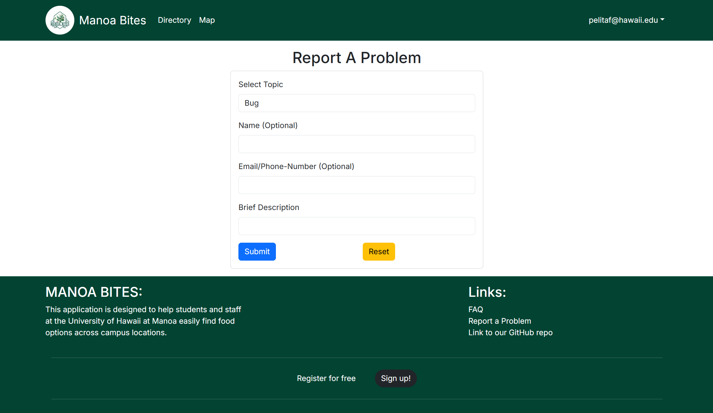
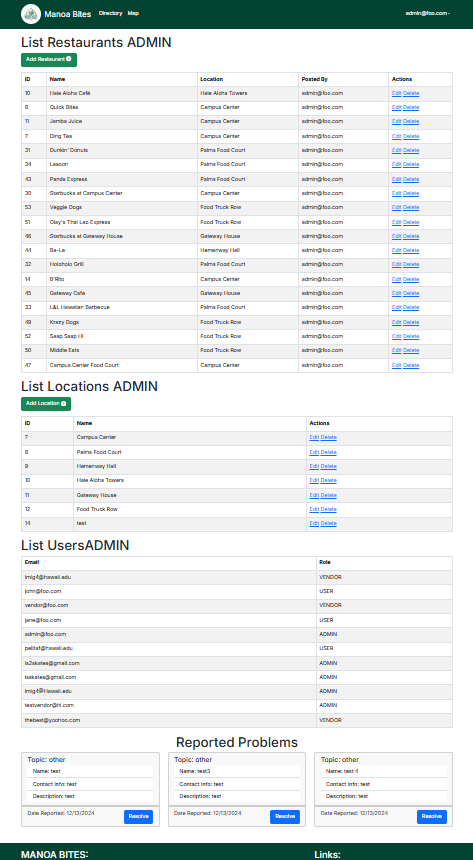
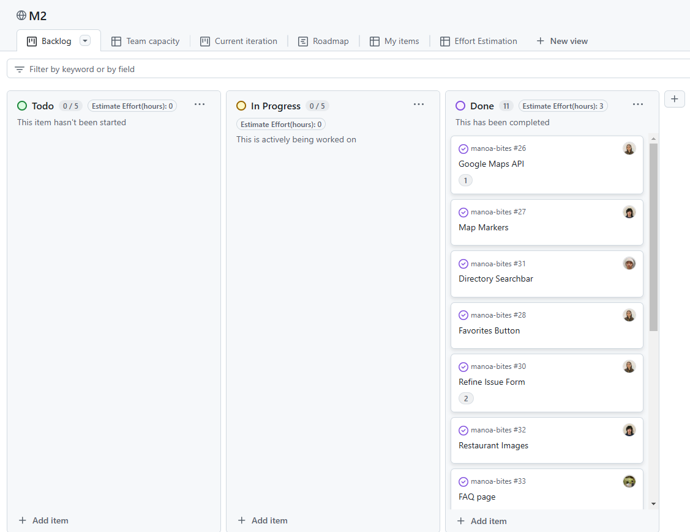

## Table of contents

* [Overview](#overview)
* [Team Contract](#team-contract)
* [Deployment](#deployment)
* [User Guide](#user-guide)
* [Community Feedback](#community-feedback)
* [Developer Guide](#developer-guide)
* [Development History](#development-history)
* [Continuous Integration](#continuous-integration)
* [Example Enhancements](#example-enhancements)
* [Team](#team)

<!--
   NOT HERE YET
* [Walkthrough Videos](#walkthrough-videos)

-->

## Overview

Manoa Bites is a web application designed to help students and staff at the University of Hawaii at Manoa easily find food options across campus locations. With Manoa Bites, users can discover available menu items, search for specific restraurants, and find out which dishes are being served on any given day. Key features include:

* **Campus-wide Food Directory**: Consolidates food options from Campus Center, food trucks, Manoa Gardens, and other campus locations.
* **Real-time Updates**: Vendors can log in to update daily menus, ensuring users always see current options.
* **Personalized Experience**: Users can set food preferences and get suggestions tailored to their tastes.
* **Roles**: Three user roles (Users, Vendors, and Admins) for personalized and manageable access.


## Team Contract
Our team contract can be found <a href="https://docs.google.com/document/d/1nAwAa54P1vTGNB8MZJTzEddC39ePGWRlMXVhibOSc9M/edit?tab=t.0">here.</a>


## Deployment

Manoa Bites is deployed on <a href="https://manoa-bites.vercel.app/">https://manoa-bites.vercel.app/</a> for easy access by the UH Manoa community. To start using the app, go to the deployment link and create an account or log in to access all features.

## User Guide 

This section provides a walkthrough of the Manoa Bites user interface and its capabilities.

### Landing Page/Directory


The landing page of Manoa Bites brings up this page where they are already presented with cards displaying restaurants and their restaurants. We are currently in the middle of testing the functions to add/edit restaurants so our images are not fully uploaded yet. We also added a search bar that has zero functionality yet that we hope to get finished in M3.

### Search Bar on LandingPage/Directory



The search bar found on the landing page allows users to sort through the restaurants by name in ascending and descending order and by location on campus. This feature can be accessed throught the sort dropdown. Users can also for a specific restaurant by utilizing the form that displays "Search for a Restaurant."


### Map Page


The Map index page is available to preview without having to log-in and displays an interactive Map centered at UH Manoa's Campus. There are markers here that make the locations easy to find. The initial markers just mark the main locations on UH Manoa's Campus. The drop down selection will load the marker for the selected restaurant.

### Map for Selected Restaurant


### Sign in and Sign up

Clicking on the "Login" button on the right side of the nav-bar will pop up a dropdown menu that gives users the choice of signing in to an existing account or to sign up for a new account. Clicking on the Sign in, will navigate you to this page:



Clicking "Sign Up" will take you to this page:


After signing in/up you will have three options when you click on your email in the top right corner of the page.

### Favorites Page

After Signing in to an existing account, users can access their favorite restaurants they saved but clicking on their email in the right of the navbar. Clicking on "Favorites" will take you to this page that loads the Restaurant cards you have saved.



### Change Password

Here you can change your password as needed.


### Sign Out

Choosing "Sign Out" will redirect you to this page. When clicking either the "Sign Out" or the "Cancel" button, it will redirect you to the home page and process your choice of signing out or cancelling. 

### FAQ

In the footer of our app, we have a few Links. The first link is our FAQ page:


### Report a Problem

Another link we have is for reporting problems. This form allows us to receieve feedback from users that will be sent to the admin to review.



This form features a dropdown selection for topics that will allow for easier sorting when viewing the feedback as an admin.


### Admin Page

When logged into the admin account, there is an aditional option in the dropdown menu after clicking on your email called "Admin".


Clicking on Admin will take you to this page where the Admin can easily view/edit current Restaurants, Locations, User, and Reported Issues.



### Vendor Page

When logged in as a vendor, the same dropdown tab is available for Vendors but will only display their restaurant they add where they can edit, delete, or add a new restaurant.


## Community Feedback

We welcome feedback to improve Manoa Bites! Please take a few minutes to fill out our [Manoa Bites Feedback Form]<a href="https://forms.gle/BzFbBFjH5P7m48dK6">(https://forms.gle/BzFbBFjH5P7m48dK6)</a>, which will help us enhance the user experience.

Here are some of the feedback we have received via our Google Form:


## Developer Guide

This section provides information of interest to Meteor developers who wish to contribute to Manoa Bites or use this as a template for their own development tasks.

### Installation

First, [install PostgreSQL](https://www.postgresql.org/download/). Then create a database for your application.

```

$ createdb manoabites
Password:
$

```

Second, go to [https://github.com/manoa-bites/manoa-bites](https://github.com/manoa-bites/manoa-bites), and click on the "Code" button and select the "Use this template" button. Complete the dialog box to create a new repository that you own that is initialized with this template's files.

Third, go to your newly created repository, and click the "Clone or download" button to download your new GitHub repo to your local file system. Using [GitHub Desktop](https://desktop.github.com/) is a great choice if you use MacOS or Windows.

Fourth, cd into the directory of your local copy of the repo, and install third party libraries with:

```

$ npm install

```

Fifth, create a `.env` file from the `sample.env`. Set the `DATABASE_URL` variable to match your PostgreSQL database that you created in the first step. See the Prisma docs [Connect your database](https://www.prisma.io/docs/getting-started/setup-prisma/add-to-existing-project/relational-databases/connect-your-database-typescript-postgresql). Then run the Prisma migration `npx prisma migrate dev` to set up the PostgreSQL tables.

```

$ npx prisma migrate dev
Environment variables loaded from .env
Prisma schema loaded from prisma/schema.prisma
Datasource "db": PostgreSQL database "<your database name>", schema "public" at "localhost:5432"

Applying migration `20240708195109_init`

The following migration(s) have been applied:

migrations/
└─ 20240708195109_init/
└─ migration.sql

Your database is now in sync with your schema.

✔ Generated Prisma Client (v5.16.1) to ./node_modules/@prisma/client in 51ms

$

```

Then seed the database with the `/config/settings.development.json` data using `npx prisma db seed`.

```

$ npx prisma db seed
Environment variables loaded from .env
Running seed command `ts-node --compiler-options {"module":"CommonJS"} prisma/seed.ts` ...
Seeding the database
Creating user: admin@foo.com with role: ADMIN
Creating user: john@foo.com with role: USER

🌱 The seed command has been executed.
$

```

## Running the system

Once the libraries are installed and the database seeded, you can run the application by invoking the "dev" script in the [package.json file](https://github.com/ics-software-engineering/nextjs-application-template/blob/master/app/package.json):

```

$ npm run dev

> nextjs-application-template-1@0.1.0 dev
> next dev

▲ Next.js 14.2.4

- Local: http://localhost:3000
- Environments: .env

✓ Starting...
✓ Ready in 1619ms

```

### Viewing the running app

If all goes well, the template application will appear at [http://localhost:3000](http://localhost:3000). You can login using the credentials in [settings.development.json](https://github.com/ics-software-engineering/nextjs-application-template/blob/main/config/settings.development.json), or else register a new account.

### ESLint

You can verify that the code obeys our coding standards by running ESLint over the code in the src/ directory with:

```
$ npm run lint

> nextjs-application-template-1@0.1.0 lint
> next lint

✔ No ESLint warnings or errors
$
```

## Development History

### Milestone #1: Rough drafts

<a href="https://github.com/orgs/manoa-bites/projects/2">Here is the link to our M1 project page.</a>

For this Milestone, we primarily focused on setting up simple database models and pages/components. We have completed implementing the majority of our pages.


### Milestone #2: Refinement

<a href="https://github.com/orgs/manoa-bites/projects/4">Here is the link to our M2 project page.</a>

In this upcoming Milestone we plan to add more information and functionality to our page. With our restaurant cards we aim to add more information about the restaurant(i.e. an image/logo, hours of operations, and brief description). Also we still need to make the favorites button on the restaurant card functional where it will save it to the Users favorites. 



### Milestone #3: Finishing Touches

<a href="https://github.com/orgs/manoa-bites/projects/6/views/1">Here is the link to our M3 project page.</a>

In this Milestone we added a bit more functionality to the admin page and search bar. We then started adding real data into our database to reflect real restaurants on campus.


## Continuous Integration

[](https://github.com/manoa-bites/manoa-bites/actions/workflows/ci.yml)

Manoa Bites uses GitHub Actions for continuous integration, ensuring code quality and passing tests on every commit. You can see the results of all recent "workflows" at <a href="https://github.com/manoa-bites/manoa-bites/actions">https://github.com/manoa-bites/manoa-bites/actions</a>.


## Example Enhancements

Enhancements that could further improve Manoa Bites include:

* Adding notifications for when favorite items are available.
* Allowing users to filter menus by dietary preferences (e.g., vegan, gluten-free).
* Enabling a feedback system for users to rate menu items.
* Having a search bar in the google map on the Maps tab.

<!-- 


## Walkthrough Videos

* [Manoa Bites Overview (5 min)](https://www.youtube.com/samplelink)
* [Manoa Bites Feature Walkthrough (10 min)](https://www.youtube.com/samplelink)


--> 

## Team

Manoa Bites is designed, implemented, and maintained by:

- **John Bernardo** 
- **Leighton Miguel** 
- **Caleb Hopkins** 
- **Jingyu Huang** 
- **Pelita Felicitas** 


