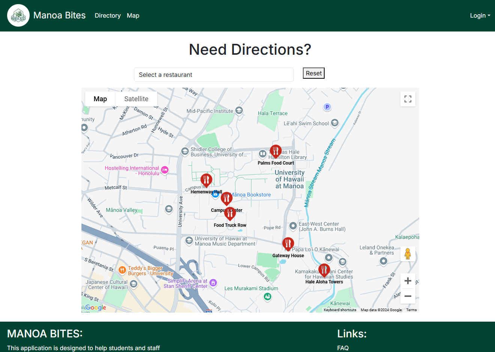

## Table of contents

* [Overview](#overview)
* [Team Contract](#team-contract)
* [Deployment](#deployment)
* [User Guide](#user-guide)
* [Developer Guide](#developer-guide)
* [Development History](#development-history)
* [Team](#team)

<!--
   NOT HERE YET
* [Community Feedback](#community-feedback)
* [Continuous Integration](#continuous-integration)
* [Walkthrough Videos](#walkthrough-videos)
* [Example Enhancements](#example-enhancements)
-->

## Overview

Manoa Bites is a web application designed to help students and staff at the University of Hawaii at Manoa easily find food options across campus locations. With Manoa Bites, users can discover available menu items, search for specific restraurants, and find out which dishes are being served on any given day. Key features include:

* **Campus-wide Food Directory**: Consolidates food options from Campus Center, food trucks, Manoa Gardens, and other campus locations.
* **Real-time Updates**: Vendors can log in to update daily menus, ensuring users always see current options.
* **Personalized Experience**: Users can set food preferences and get suggestions tailored to their tastes.
* **Roles**: Three user roles (Users, Vendors, and Admins) for personalized and manageable access.


## Team Contract
Our team contract can be found <a href="https://docs.google.com/document/d/1nAwAa54P1vTGNB8MZJTzEddC39ePGWRlMXVhibOSc9M/edit?tab=t.0">here.</a>


## Deployment

Manoa Bites is deployed on <a href="https://manoa-bites.vercel.app/">https://manoa-bites.vercel.app/</a> for easy access by the UH Manoa community. To start using the app, go to the deployment link and create an account or log in to access all features.

## User Guide 

This section provides a walkthrough of the Manoa Bites user interface and its capabilities.

### Landing Page/Directory


The landing page of Manoa Bites brings up this page where they are already presented with cards displaying restaurants and their restaurants.


### Map Page



The Map index page is available to preview without having to log-in and displays an interactive Map centered at UH Manoa's Campus.

### Sign in and Sign up

Clicking on the "Login" button on the right side of the nav-bar will pop up a dropdown menu that gives users the choice of signing in to an existing account or to sign up for a new account. Clicking on the Sign in, will navigate you to this page:


Clicking "Sign Up" will take you to this page:


### Favorites Page

After Signing in to an existing account, users can access their favorite restaurants they saved but clicking on their email in the right of the navbar.


Clicking on "Favorites" will take you to this page that loads the Restaurant cards you have saved.


### FAQ

In the footer of our app, we have a few Links. The first link is our FAQ page:


### Report a Problem

Another link we have is for reporting problems. This form allows us to receieve feedback from users that will be sent to the admin to review.


This form features a dropdown selection for topics that will allow for easier sorting when viewing the feedback as an admin.


## Development History

### Milestone #1: Rough drafts

<a href="https://github.com/orgs/manoa-bites/projects/2">Here is the link to our M1 project page.</a>

For this Milestone, we primarily focused on setting up simple database models and pages/components. We have completed implementing the majority of our pages.


### Milestone #2: Refinement

<a href="https://github.com/orgs/manoa-bites/projects/4">Here is the link to our M2 project page.</a>

In this upcoming Milestone we plan to add more information and functionality to our page. With our restaurant cards we aim to add more information about the restaurant(i.e. an image/logo, hours of operations, and brief description). Also we still need to make the favorites button on the restaurant card functional where it will save it to the Users favorites. 


<!-- 

## Community Feedback

We welcome feedback to improve Manoa Bites! Please take a few minutes to fill out our [Manoa Bites Feedback Form](https://forms.gle/samplelink), which will help us enhance the user experience.

## Developer Guide

This section provides setup and development information for those who wish to contribute to Manoa Bites.

### Installation

1. Clone the repository:
   ```bash
   git clone https://github.com/ManoaBites/Manoa-bites-app.git

2. Install the dependencies:
   ```bash
   npm install
   
3. Start the application:
   ```bash
   npm start
  

## Continuous Integration

Manoa Bites uses GitHub Actions for continuous integration, ensuring code quality and passing tests on every commit.

## Walkthrough Videos

* [Manoa Bites Overview (5 min)](https://www.youtube.com/samplelink)
* [Manoa Bites Feature Walkthrough (10 min)](https://www.youtube.com/samplelink)


## Example Enhancements

Enhancements that could further improve Manoa Bites include:

* Adding notifications for when favorite items are available.
* Allowing users to filter menus by dietary preferences (e.g., vegan, gluten-free).
* Enabling a feedback system for users to rate menu items.
--> 

## Team

Manoa Bites is designed, implemented, and maintained by:

- **John Bernardo** 
- **Leighton Miguel** 
- **Caleb Hopkins** 
- **Jingyu Huang** 
- **Pelita Felicitas** 


