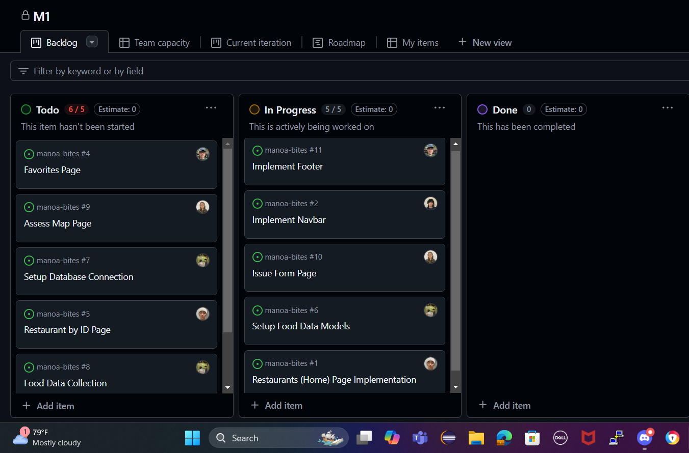

# Manoa Bites

## Table of contents

* [Overview](#overview)
* [Deployment](#deployment)
* [User Guide](#user-guide)
* [Community Feedback](#community-feedback)
* [Developer Guide](#developer-guide)
* [Development History](#development-history)
* [Continuous Integration](#continuous-integration)
* [Walkthrough Videos](#walkthrough-videos)
* [Example Enhancements](#example-enhancements)
* [Team](#team)

## Overview

Manoa Bites is a web application designed to help students and staff at the University of Hawaii at Manoa easily find food options across campus locations. With Manoa Bites, users can discover available menu items, search for specific cuisines, and find out which dishes are being served on any given day. Key features include:

* **Campus-wide Food Directory**: Consolidates food options from Campus Center, food trucks, Manoa Gardens, and other campus locations.
* **Real-time Updates**: Vendors can log in to update daily menus, ensuring users always see current options.
* **Personalized Experience**: Users can set food preferences and get suggestions tailored to their tastes.
* **Roles**: Three user roles (Users, Vendors, and Admins) for personalized and manageable access.

## Deployment

Manoa Bites is deployed on [link-to-deployment] for easy access by the UH Manoa community. To start using the app, go to the deployment link and create an account or log in to access all features.

## User Guide

This section provides a walkthrough of the Manoa Bites user interface and its capabilities.

### Landing Page

The landing page introduces users to Manoa Bites and provides links to log in or sign up.


### Dashboard

After logging in, users are taken to the dashboard, where they can browse menu items, search for specific food types, and set preferences.


### Vendor Menu Update

Vendors can log in to update their daily menu items, ensuring that users always see current options across campus.


## Community Feedback

We welcome feedback to improve Manoa Bites! Please take a few minutes to fill out our [Manoa Bites Feedback Form](https://forms.gle/samplelink), which will help us enhance the user experience.

## Developer Guide

This section provides setup and development information for those who wish to contribute to Manoa Bites.

### Installation

1. Clone the repository:
   ```bash
   git clone https://github.com/ManoaBites/Manoa-bites-app.git

2. Install the dependencies:
   ```bash
   npm install
   
3. Start the application:
   ```bash
   npm start


   ## Development History

Manoa Bites was developed using Issue Driven Project Management, with tasks organized into milestones. Each milestone reflects a set of features implemented by our team.

Our current Milestone 1 project board [here](https://github.com/orgs/manoa-bites/projects/2)




## Continuous Integration

Manoa Bites uses GitHub Actions for continuous integration, ensuring code quality and passing tests on every commit.

## Walkthrough Videos

* [Manoa Bites Overview (5 min)](https://www.youtube.com/samplelink)
* [Manoa Bites Feature Walkthrough (10 min)](https://www.youtube.com/samplelink)

## Example Enhancements

Enhancements that could further improve Manoa Bites include:

* Adding notifications for when favorite items are available.
* Allowing users to filter menus by dietary preferences (e.g., vegan, gluten-free).
* Enabling a feedback system for users to rate menu items.

## Team

Manoa Bites is designed, implemented, and maintained by:

<!-- - **John Bernardo** – Frontend Developer
- **Leighton Miguel** – Backend Developer
- **Caleb Hopkins** – UI/UX Designer
- **Jingyu Huang** – Database Specialist
- **Pelita Felicitas** – Project Manager -->

